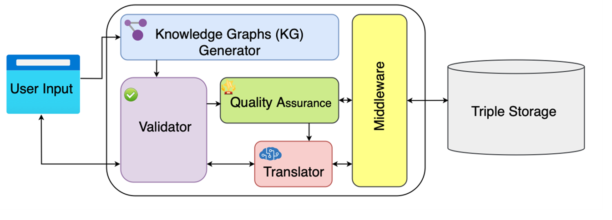

# Heritage Graph Architecture

## Overview

The system follows a structured pipeline to **digitize and preserve cultural heritage** through **Knowledge Graphs (KGs)**. The architecture consists of multiple components working together to ensure structured **data representation, validation, and storage**.

## System Components

##  User Input  
- **Digitized artifacts**: Texts, images, audio/video recordings.  
- **Historical records**: Oral traditions, academic research.  
- **Community contributions**: Local stories, rituals, festivals.  
- **Data formats**: Supports text, CSV, JSON, images.  
- **Language support**: Nepali, Maithili, English.  

## Knowledge Graph Generator  
- **Converts raw input into structured triples** (subject-predicate-object).  
- **Entity Extraction**: Identifies key entities (e.g., *Pashupatinath Temple, Dashain Festival*).  
- **Relationship Mapping**: Links entities via semantic relationships (e.g., *"Dashain isCelebratedIn Nepal"*).  
- **Ontology Alignment**: Uses a pre-defined cultural heritage ontology.  
- **Technologies**: NLP libraries (spaCy), metadata extraction scripts.  

## Validator  
-  **Ensures logical consistency and accuracy**.  
- **Schema Validation**: Confirms triples align with the ontology.  
- **Data Integrity**: Flags contradictions (*"Lumbini isIn India"* vs. *"Lumbini isIn Nepal"*).  
- **Source Credibility**: Cross-references trusted repositories (e.g., **National Archives of Nepal**).  

## Quality Assurance  
- **Automated QA**: Runs rule-based checks (e.g., missing metadata).  
- **Human-in-the-Loop**: Experts (historians, anthropologists) review entries.  
- **Feedback Loop**: Updates KG based on findings.  

## Translator  
- **Multilingual Support**: Converts labels into Nepali, Bhojpuri, Sherpa.  
- **Semantic Context Preservation**: Retains cultural nuances (*"Guthi" ≠ "committee"*).  
- **Cross-Lingual Linking**: Connects terms across languages (*"Tihar" ↔ "Deepawali"*).  

## Middleware  
- **API Integration**: Connects to external databases (UNESCO, Wikidata).  
- **Workflow Orchestration**: Manages data flow between KG Generator, Validator, and Triple Storage.  
- **Security Layer**: Authenticates user contributions and restricts sensitive access.  

## Triple Storage  
- **Database**: RDF triple store (e.g., Apache Jena, GraphDB).  
- **Querying**: SPARQL queries (e.g., *"Show all artifacts linked to Malla Dynasty"*).  
- **Interoperability**: Exports data in RDF, JSON-LD for global integration.  

